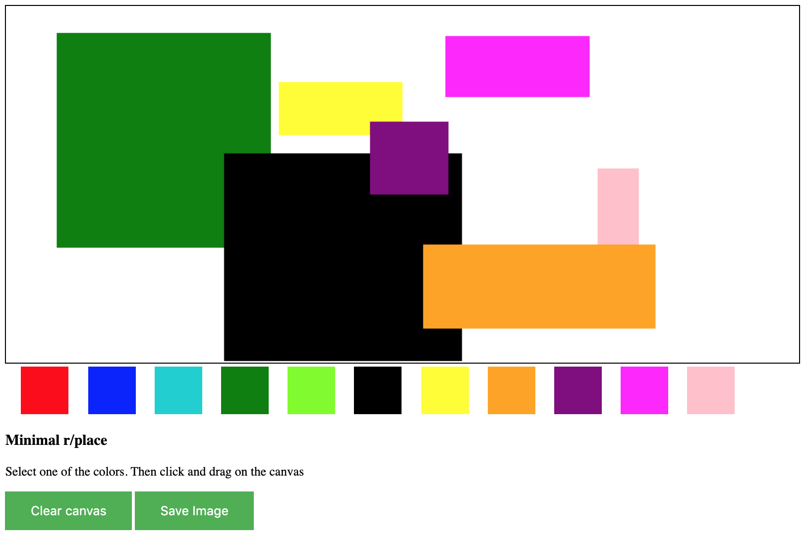

# Place

Our collaborative drawing application is inspired by the collaborative drawing application that was created on `reddit.com/r/place` that allows users to place one pixel on a canvas every 5 minutes. Our application allows users to select from 11 different colors, and then draw rectangles or lines in the selected color on the canvas. Any other users running the application on the same network and port number, will also see any user who is drawing and vice-versa. Users act as both the client and server, so every time the application is run the canvas starts blank, and only drawings that are done subsequently will be visible.

1. Make sure `node.js` and `npm` are installed.
2. Run `npm install` to get the dependencies.
3. Run `npm start` to start the server
4. Start drawing! 

### Screenshot

### Try it out live

[https://cryptic-spire-50604.herokuapp.com](https://cryptic-spire-50604.herokuapp.com)

- Open above link in Chrome and another session in Safari
- Start painting and see both places update

#### Improvements to be made

- Add caching to store currently drawn shapes before another user joins
